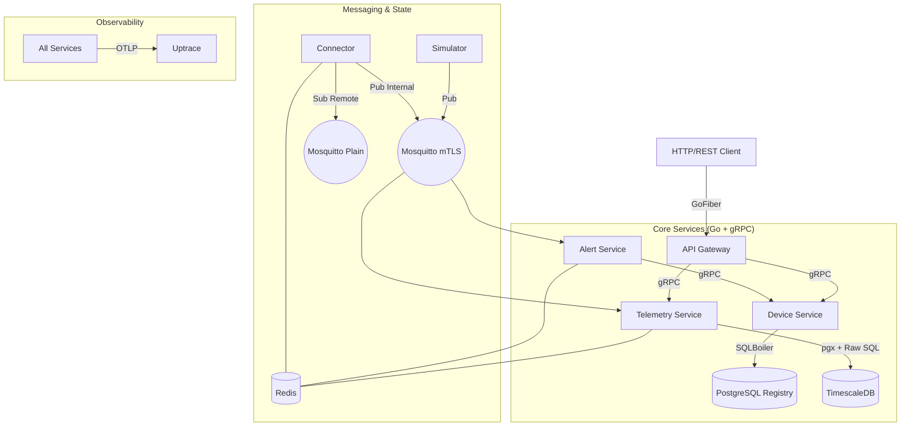

# FieldPulse
Industrial IoT Backend Platform

# architecture (v2 - more focus on Open Source Lib)
# Architecture Design (Mermaid)

```mermaid
graph TD
    Client[HTTP/REST Client] -->|GoFiber| Gateway[API Gateway]
    
    subgraph "Core Services (Go + gRPC)"
        Gateway -->|gRPC| DeviceSvc[Device Service]
        Gateway -->|gRPC| TelemetrySvc[Telemetry Service]
        
        DeviceSvc -->|SQLBoiler| Postgres[(PostgreSQL Registry)]
        TelemetrySvc -->|pgx + Raw SQL| Timescale[(TimescaleDB)]
        
        AlertSvc[Alert Service] -->|gRPC| DeviceSvc
    end
    
    subgraph "Messaging & State"
        InternalMQTT((Mosquitto mTLS))
        RemoteMQTT((Mosquitto Plain))
        Redis[(Redis)]
        
        Simulator -->|Pub| InternalMQTT
        Connector -->|Sub Remote| RemoteMQTT
        Connector -->|Pub Internal| InternalMQTT
        
        InternalMQTT --> TelemetrySvc
        InternalMQTT --> AlertSvc
        
        TelemetrySvc & AlertSvc & Connector --- Redis
    end
    
    subgraph "Observability"
        AllServices[All Services] -->|OTLP| Uptrace[Uptrace]
    end
```