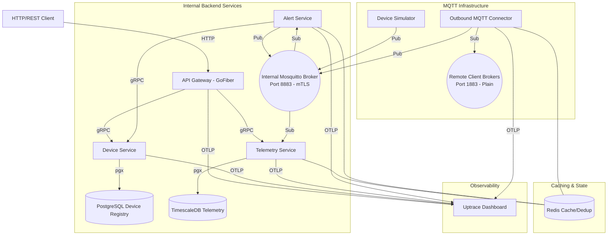

# FieldPulse
Industrial IoT Backend Platform

# architecture (v1)
# Architecture Design (Mermaid)

```mermaid
graph TD
    Client[HTTP/REST Client] -->|HTTP| Gateway[API Gateway - GoFiber]
    
    subgraph "Internal Backend Services"
        Gateway -->|gRPC| DeviceSvc[Device Service]
        Gateway -->|gRPC| TelemetrySvc[Telemetry Service]
        
        DeviceSvc -->|pgx| Postgres[(PostgreSQL Device Registry)]
        TelemetrySvc -->|pgx| Timescale[(TimescaleDB Telemetry)]
        
        AlertSvc[Alert Service] -->|gRPC| DeviceSvc
        AlertSvc -->|Pub| LocalMQTT
    end
    
    subgraph "MQTT Infrastructure"
        LocalMQTT((Internal Mosquitto Broker\nPort 8883 - mTLS))
        RemoteMQTT((Remote Client Brokers\nPort 1883 - Plain))
        
        Simulator[Device Simulator] -->|Pub| LocalMQTT
        Connector[Outbound MQTT Connector] -->|Sub| RemoteMQTT
        Connector -->|Pub| LocalMQTT
        
        LocalMQTT -->|Sub| TelemetrySvc
        LocalMQTT -->|Sub| AlertSvc
    end
    
    subgraph "Caching & State"
        TelemetrySvc --- Redis[(Redis Cache/Dedup)]
        AlertSvc --- Redis
        Connector --- Redis
    end
    
    subgraph "Observability"
        Gateway & DeviceSvc & TelemetrySvc & AlertSvc & Connector -->|OTLP| Uptrace[Uptrace Dashboard]
    end
```